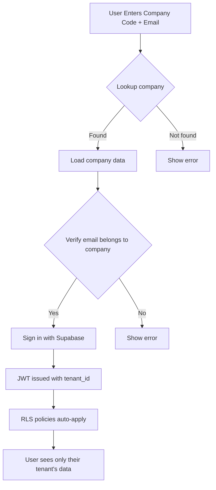

# Multi-Tenant Architecture Guide

## Overview

Expiry Sentinel Pro implements a **row-level security (RLS) based multi-tenant architecture** that provides complete data isolation between companies while running on a single database.

---

## 🏗️ Architecture Design

### Single Database, Multiple Tenants

```
┌─────────────────────────────────────────────┐
│           PostgreSQL Database               │
├──────────────┬──────────────┬───────────────┤
│   Tenant A   │   Tenant B   │   Tenant C    │
│   (JPF)      │   (HOTEL)    │   (Admin)     │
│              │              │               │
│ • 50 users   │ • 30 users   │ • 1 system    │
│ • 200 items  │ • 150 items  │ • N/A         │
│ • 100 logs   │ • 80 logs    │ • All logs    │
└──────────────┴──────────────┴───────────────┘
    ↓              ↓               ↓
   RLS            RLS            RLS
 (Rules)         (Rules)         (Rules)
```

### Data Isolation Strategy

Each record includes `tenant_id` to identify its owner:

```sql
-- Example: users are isolated by tenant_id
SELECT * FROM profiles 
WHERE tenant_id = auth.tenant_id()  -- Only current tenant's users
```

---

## 🔐 Row-Level Security (RLS)

### How RLS Works

1. **Every query is automatically filtered** by the current tenant
2. **Policies prevent cross-tenant access** at the database level
3. **Frontend cannot bypass** database-level security

### RLS Policy Example

```sql
-- Policy on 'profiles' table
CREATE POLICY "Tenant Isolation"
ON profiles
FOR ALL
USING (
  tenant_id = get_current_tenant_id()
)
WITH CHECK (
  tenant_id = get_current_tenant_id()
);
```

### Breakdown

| Component | Meaning |
|-----------|----------|
| `USING` | For SELECT/DELETE - only return rows where condition is true |
| `WITH CHECK` | For INSERT/UPDATE - only allow if condition is true |
| `get_current_tenant_id()` | Helper function that returns authenticated user's tenant |

---

## 👥 User-to-Tenant Association

### How Users Connect to Tenants

```sql
-- profiles table structure
CREATE TABLE profiles (
  id UUID PRIMARY KEY,
  email TEXT,
  tenant_id UUID NOT NULL REFERENCES tenants(id),  -- ← Links to tenant
  role VARCHAR,
  created_at TIMESTAMP,
  CONSTRAINT one_tenant_per_user UNIQUE(email, tenant_id)
);
```

### User Types

| User Type | Tenant ID | Access |
|-----------|-----------|--------|
| **System Admin** | `NULL` | All tenants (via TenantContext switcher) |
| **Tenant Admin** | `tenant-uuid` | Only their tenant |
| **Regular User** | `tenant-uuid` | Only their tenant |

---

## 🔑 Helper Functions

### 1. Get Current Tenant ID

```sql
CREATE FUNCTION get_current_tenant_id() 
RETURNS UUID AS $$
  SELECT 
    CASE
      WHEN auth.jwt() ->> 'app_metadata'->>'tenant_id' != 'null'
      THEN (auth.jwt() ->> 'app_metadata'->>'tenant_id')::UUID
      ELSE NULL
    END
$$ LANGUAGE SQL STABLE;
```

**What it does:**
- Reads tenant_id from JWT (stored during login)
- Returns NULL for system admins
- Returns tenant-uuid for regular users

### 2. Check if System Admin

```sql
CREATE FUNCTION is_system_admin() 
RETURNS BOOLEAN AS $$
  SELECT (auth.jwt() ->> 'app_metadata'->>'role' = 'system_admin')
$$ LANGUAGE SQL STABLE;
```

### 3. Check Feature Enabled

```sql
CREATE FUNCTION is_feature_enabled(p_feature TEXT)
RETURNS BOOLEAN AS $$
  SELECT enabled FROM feature_toggles
  WHERE tenant_id = get_current_tenant_id()
    AND feature_key = p_feature
$$ LANGUAGE SQL STABLE;
```

---

## 🔄 Login Flow

### Step-by-Step



### JWT Payload Example

```json
{
  "sub": "user-uuid",
  "email": "user@company.com",
  "app_metadata": {
    "provider": "email",
    "tenant_id": "company-uuid",
    "role": "admin",
    "company_name": "JPF",
    "company_code": "JPF"
  }
}
```

---

## 📊 Tables Protected by RLS

### Core HR Tables

```sql
-- All these tables enforce tenant isolation
ALTER TABLE profiles ENABLE ROW LEVEL SECURITY;
ALTER TABLE items ENABLE ROW LEVEL SECURITY;
ALTER TABLE evaluations ENABLE ROW LEVEL SECURITY;
ALTER TABLE departments ENABLE ROW LEVEL SECURITY;
ALTER TABLE reminder_rules ENABLE ROW LEVEL SECURITY;
```

### Policy Pattern

All follow the same pattern:

```sql
CREATE POLICY "tenant_isolation_[table_name]"
ON [table_name]
FOR ALL
USING (tenant_id = get_current_tenant_id())
WITH CHECK (tenant_id = get_current_tenant_id());
```

---

## 🛡️ Preventing Cross-Tenant Access

### Database-Level Protection

```sql
-- Trigger: Prevent tenant_id modification
CREATE TRIGGER prevent_tenant_id_change
BEFORE UPDATE ON profiles
FOR EACH ROW
WHEN (OLD.tenant_id IS DISTINCT FROM NEW.tenant_id)
EXECUTE FUNCTION raise_immutable_error();
```

### Frontend Check (Defense in Depth)

```typescript
// Hook: Auto-filter by tenant
export const useTenantQuery = () => {
  const { tenant } = useContext(TenantContext);
  
  return async (query) => {
    // Add tenant filter to every query
    return query.eq('tenant_id', tenant.id);
  };
};
```

---

## 🔑 Admin Features

### Super Admin Mode

Super admins (System Admin role) can:

1. **View All Tenants** - TenantSwitcher component
2. **Create New Tenants** - `/tenant-management`
3. **Manage Users Across Tenants** - Switch context
4. **View System-Wide Analytics**
5. **Configure Feature Flags**

### Code Access

```typescript
// Check if super admin
if (userRole === 'system_admin') {
  // Show tenant switcher
  <TenantSwitcher />
  // Show all tenants
  const allTenants = await supabase.from('tenants').select('*');
}
```

---

## 🚨 Security Checklist

- ✅ RLS enabled on all sensitive tables
- ✅ `WITH CHECK` policies prevent unauthorized INSERT/UPDATE
- ✅ `tenant_id` immutable after creation (via trigger)
- ✅ JWT includes tenant_id for every request
- ✅ Helper functions validate tenant context
- ✅ Feature toggles respect tenant isolation
- ✅ Audit log includes tenant_id for all operations
- ✅ Storage buckets use tenant-based paths
- ✅ Edge Functions validate tenant context
- ✅ Notification system filters by tenant

---

## 🐛 Troubleshooting

### Problem: User sees data from another tenant

**Cause:** RLS policy not enabled on table

**Solution:**
```sql
ALTER TABLE [table_name] ENABLE ROW LEVEL SECURITY;
```

### Problem: Query returns empty when it shouldn't

**Cause:** `get_current_tenant_id()` returns NULL

**Solution:** Verify JWT includes `app_metadata.tenant_id`

### Problem: Super admin cannot access tenant data

**Cause:** Policy blocks NULL tenant_id

**Solution:** Add bypass for system admins
```sql
CREATE POLICY "admin_bypass"
ON profiles
FOR ALL
USING (
  tenant_id = get_current_tenant_id() 
  OR is_system_admin()
);
```

---

## 📚 Related Documentation

- [README.md](../README.md) - Main project documentation
- [INTEGRATIONS.md](../INTEGRATIONS.md) - Integration guide
- [API.md](./API.md) - API reference

---

**Last Updated:** January 29, 2026  
**Version:** 2.0.0  
**Maintained by:** Abdulrhman Bashniny
